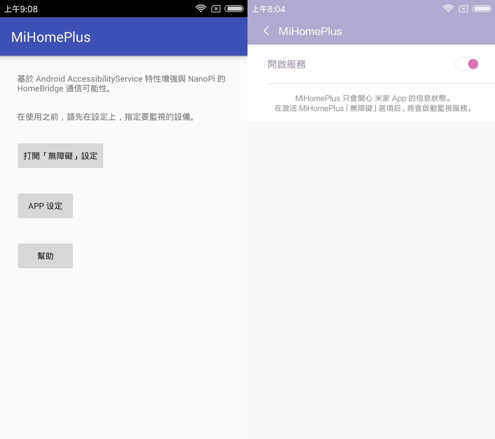
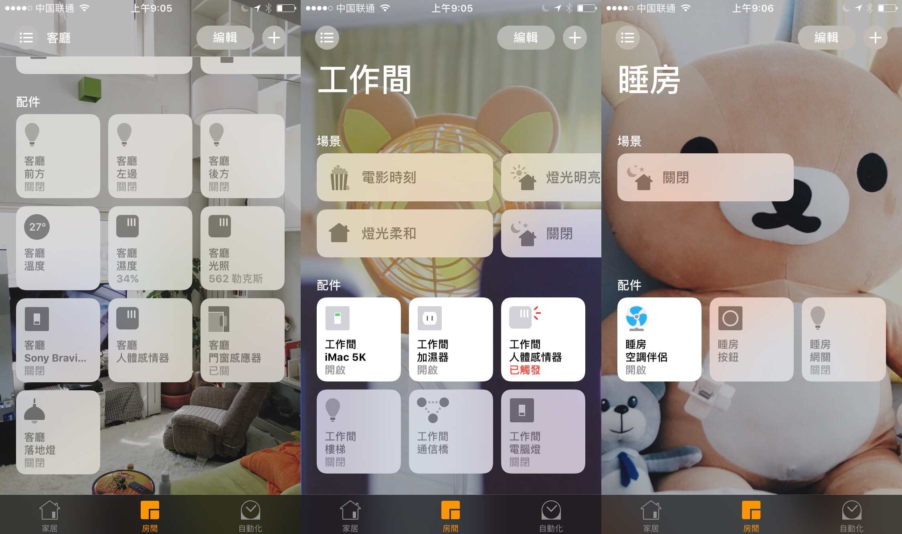

# MiHomePlus

MiHomePlus 是一個 Android App。

以透過 Android Accessibility 的特性，監視和控制「米家」App，並且和 MiPlusServer 通信。

從而達到代理米家 App 到 HomeKit 的解決方案。

### 演示視頻：

http://staticshare.5mlstudio.com/img-5168-mov(2017-06-20T08:13:45+08:00).mov

### 圖片：






## 支持設備

大部分的「米家」設備。

包含空調伴侶、第一代智能開關等。


## 操作原理

調用「無障礙」特性，監視和控制米家 App，當「TYPE_WINDOW_CONTENT_CHANGED」觸發時候，與 MiPlusServer 同步設備狀態。

與 MiPlusServer 透過 Socket.io 觸發 MIHomePlus 進行狀態切換。

在 Homebridge 基於 Switcheroo 插件提供操作接口。

所以 MiPlusServer 本質是 Web 接口


## 關聯項目

##### MiPlusServer

https://github.com/qoli/MiPlusServer


## 如何使用

##### 面向于一般用戶

說明 Coming soon


##### 面向于開發者 / 高階用戶

源碼定義了 **http://192.168.1.104:3002** 作為通信服務器。

源碼 **nodeAction("空調伴侶","read")** 等為 SYNC 的內容。

透過 MiHomeServer Socket 通信「update」關鍵字，觸發 AccessibilityService 操作開關。


**當前程序尚未進行配置文檔化。**


## 使用到的其他項目

##### homebridge-switcheroo

https://github.com/chriszelazo/homebridge-switcheroo


## 示例 config.json

host 必須經過 urlencode 才可正常工作。

```json
{
  "accessory": "Switcheroo",
  "type": "switch",
  "name": "空調伴侶",
  "host": "http://192.168.1.104:3002/device/%E7%A9%BA%E8%AA%BF%E4%BC%B4%E4%BE%B6",
  "on": "/ON",
  "off": "/OFF",
  "on_body": "ON",
  "off_body": "OFF"
}
```